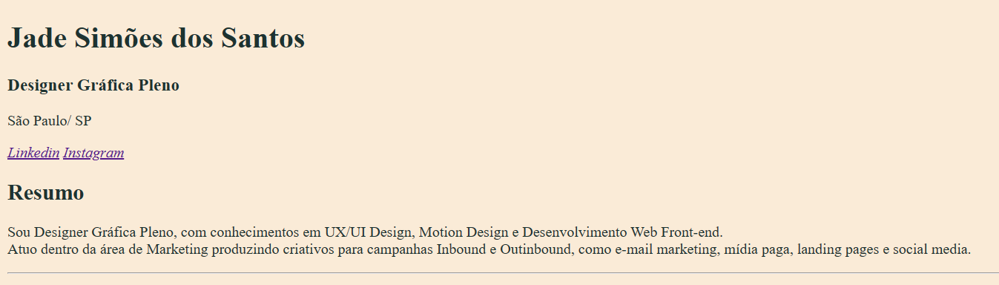

<h1 align="center"> Currículo em HTML </h1>

Atividade módulo de HTML do ElasNaTech 2023.  

  <a href="#-tecnologias">Tecnologias</a>&nbsp;&nbsp;&nbsp;|&nbsp;&nbsp;&nbsp;
  <a href="#-projeto">Projeto</a>&nbsp;&nbsp;&nbsp;

 

  

## 🚀 Tecnologias

Esse projeto foi desenvolvido com as seguintes tecnologias:

- HTML
- Git e Github

## 💻 Projeto

Atividade desenvolvida utilizando somente HTML para fixar suas principais tags.